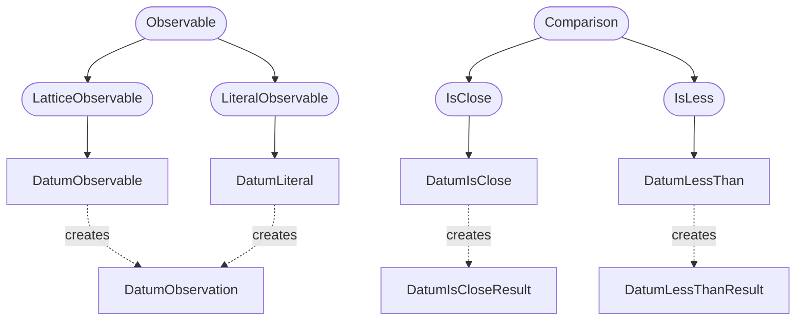
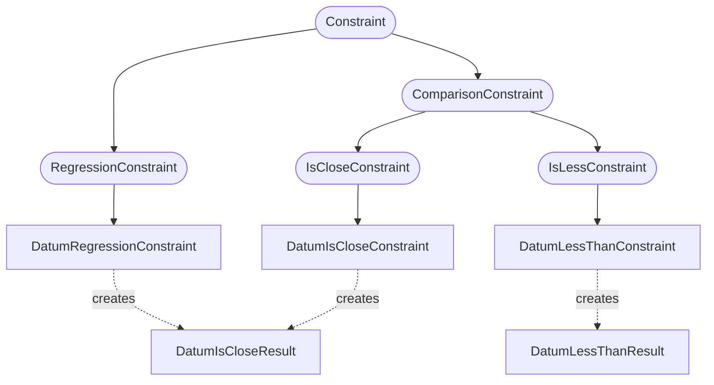

# Datum Constraints

A `DatumObservation` stores the output of a tao datum.
These can be defined and evaluated on the fly using a `DatumObservable`.

## Observation Classes

#### ::: pytao.constraints.observables.DatumObservation

### Observables

#### ::: pytao.constraints.observables.DatumObservable

#### ::: pytao.constraints.observables.DatumLiteral

### Operators and Results

#### ::: pytao.constraints.observables.DatumIsClose

#### ::: pytao.constraints.observables.DatumIsCloseResult

#### ::: pytao.constraints.observables.DatumLessThan

#### ::: pytao.constraints.observables.DatumLessThanResult

## Constraints Classes

#### ::: pytao.constraints.config.DatumIsCloseConstraint

#### ::: pytao.constraints.config.DatumLessThanConstraint

#### ::: pytao.constraints.config.DatumRegressionConstraint
