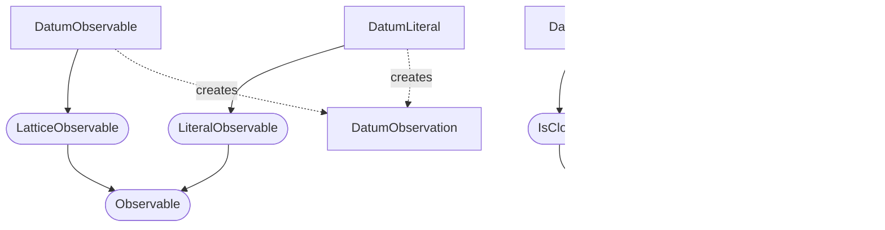
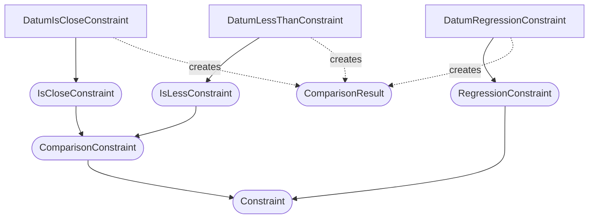

# Datum Constraints

A `DatumObservation` stores the output of a tao datum.
These can be defined and evaluated on the fly using a `DatumObservable`.
User-defined values are provided with `DatumLiteral`.

## Observation Classes

```mermaid
flowchart TD
    LatticeObservable([LatticeObservable]) --> Observable([Observable])
    LiteralObservable([LiteralObservable]) --> Observable
    DatumObservable[DatumObservable] --> LatticeObservable
    DatumLiteral[DatumLiteral] --> LiteralObservable
    IsClose([IsClose]) --> Comparison([Comparison])
    IsLess([IsLess]) --> Comparison
    DatumIsClose[DatumIsClose] --> IsClose
    DatumLessThan[DatumLessThan] --> IsLess
    DatumObservable -. creates .-> DatumObservation[DatumObservation]
    DatumLiteral -. creates .-> DatumObservation
    DatumIsClose -. creates .-> ComparisonResult([ComparisonResult])
    DatumLessThan -. creates .-> ComparisonResult
```

#### ::: pytao.constraints.observables.DatumObservation

### Observables

#### ::: pytao.constraints.observables.DatumObservable
#### ::: pytao.constraints.observables.DatumLiteral

### Operators

Both operators produce a [`ComparisonResult`](index.md#pytao.constraints.observables.ComparisonResult) whose `checks` are keyed by the field names listed below.

#### ::: pytao.constraints.observables.DatumIsClose
#### ::: pytao.constraints.observables.DatumLessThan

## Constraints Classes

```mermaid
flowchart TD
    ComparisonConstraint([ComparisonConstraint]) --> Constraint([Constraint])
    RegressionConstraint([RegressionConstraint]) --> Constraint
    IsCloseConstraint([IsCloseConstraint]) --> ComparisonConstraint
    IsLessConstraint([IsLessConstraint]) --> ComparisonConstraint
    DatumIsCloseConstraint[DatumIsCloseConstraint] --> IsCloseConstraint
    DatumLessThanConstraint[DatumLessThanConstraint] --> IsLessConstraint
    DatumRegressionConstraint[DatumRegressionConstraint] --> RegressionConstraint
    DatumIsCloseConstraint -. creates .-> ComparisonResult([ComparisonResult])
    DatumLessThanConstraint -. creates .-> ComparisonResult
    DatumRegressionConstraint -. creates .-> ComparisonResult
```

#### ::: pytao.constraints.config.DatumIsCloseConstraint
#### ::: pytao.constraints.config.DatumLessThanConstraint
#### ::: pytao.constraints.config.DatumRegressionConstraint
