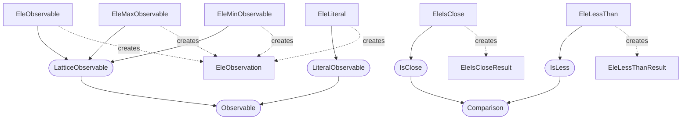
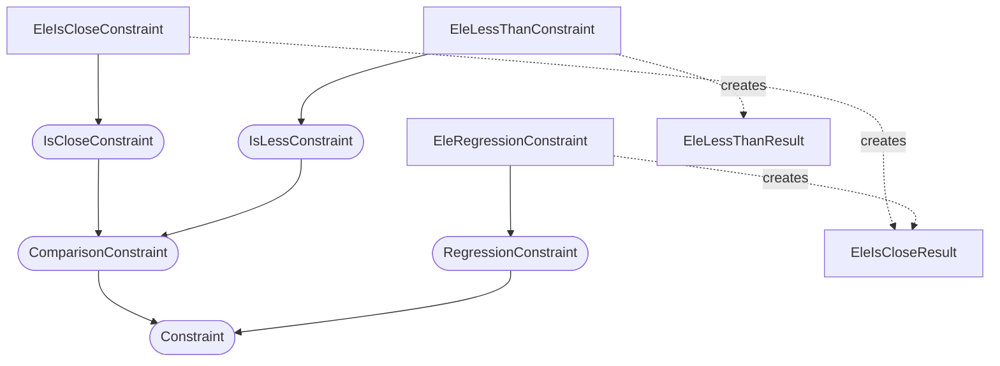

# Element Constraints

An `EleObservation` contains the output of a `tao.ele(...)` call (ie Twiss parameters, reference energy, floor positions, etc.).
The observation may be evaluted from a single element in a lattice with `EleObservable`.
The min and max of the values in the element can be evaluated using `EleMinObservable` and `EleMaxObservable`.

## Observation Classes

#### ::: pytao.constraints.observables.EleObservation

### Observables

#### ::: pytao.constraints.observables.EleObservable
#### ::: pytao.constraints.observables.EleMinObservable
#### ::: pytao.constraints.observables.EleMaxObservable
#### ::: pytao.constraints.observables.EleLiteral

### Operators and Results

#### ::: pytao.constraints.observables.EleIsClose
#### ::: pytao.constraints.observables.EleLessThanResult
#### ::: pytao.constraints.observables.EleLessThan
#### ::: pytao.constraints.observables.EleIsCloseResult

### Operator Helper Classes

#### ::: pytao.constraints.observables.TolComparison
#### ::: pytao.constraints.observables.BmagTwissComparison

## Constraints, and Results

#### ::: pytao.constraints.config.EleIsCloseConstraint
#### ::: pytao.constraints.config.EleLessThanConstraint
#### ::: pytao.constraints.config.EleRegressionConstraint
