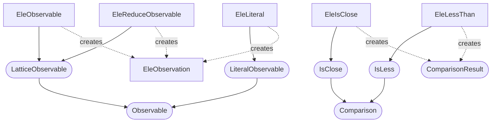
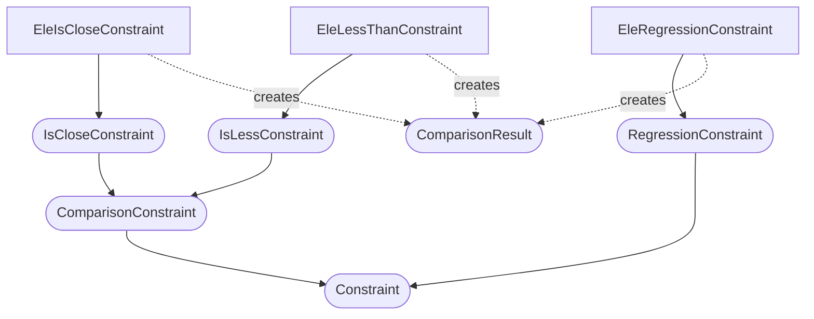

# Element Constraints

An `EleObservation` contains the output of a `tao.ele(...)` call (ie Twiss parameters, reference energy, floor positions, etc.).
The observation may be evaluted from a single element in a lattice with `EleObservable`.
A reduction (min, max, or avg) of the values over the tracking elements of a lattice can be evaluated using `EleReduceObservable`, with the reduction selected by its `operator` field.
User-defined values are provided with `EleLiteral`.

## Observation Classes

```mermaid
flowchart TD
    LatticeObservable([LatticeObservable]) --> Observable([Observable])
    LiteralObservable([LiteralObservable]) --> Observable
    EleObservable[EleObservable] --> LatticeObservable
    EleReduceObservable[EleReduceObservable] --> LatticeObservable
    EleLiteral[EleLiteral] --> LiteralObservable
    IsClose([IsClose]) --> Comparison([Comparison])
    IsLess([IsLess]) --> Comparison
    EleIsClose[EleIsClose] --> IsClose
    EleLessThan[EleLessThan] --> IsLess
    EleObservable -. creates .-> EleObservation[EleObservation]
    EleReduceObservable -. creates .-> EleObservation
    EleLiteral -. creates .-> EleObservation
    EleIsClose -. creates .-> ComparisonResult([ComparisonResult])
    EleLessThan -. creates .-> ComparisonResult
```

#### ::: pytao.constraints.observables.EleObservation

### Observables

#### ::: pytao.constraints.observables.EleObservable
#### ::: pytao.constraints.observables.EleReduceObservable
#### ::: pytao.constraints.observables.ele.ReduceMode
#### ::: pytao.constraints.observables.EleLiteral

### Operators

Both operators produce a [`ComparisonResult`](index.md#pytao.constraints.observables.ComparisonResult) whose `checks` are keyed by the field names listed below.

#### ::: pytao.constraints.observables.EleIsClose
#### ::: pytao.constraints.observables.EleLessThan

### Operator Helper Classes

#### ::: pytao.constraints.observables.TolComparison
#### ::: pytao.constraints.observables.BmagTwissComparison

## Constraints, and Results

```mermaid
flowchart TD
    ComparisonConstraint([ComparisonConstraint]) --> Constraint([Constraint])
    RegressionConstraint([RegressionConstraint]) --> Constraint
    IsCloseConstraint([IsCloseConstraint]) --> ComparisonConstraint
    IsLessConstraint([IsLessConstraint]) --> ComparisonConstraint
    EleIsCloseConstraint[EleIsCloseConstraint] --> IsCloseConstraint
    EleLessThanConstraint[EleLessThanConstraint] --> IsLessConstraint
    EleRegressionConstraint[EleRegressionConstraint] --> RegressionConstraint
    EleIsCloseConstraint -. creates .-> ComparisonResult([ComparisonResult])
    EleLessThanConstraint -. creates .-> ComparisonResult
    EleRegressionConstraint -. creates .-> ComparisonResult
```

#### ::: pytao.constraints.config.EleIsCloseConstraint
#### ::: pytao.constraints.config.EleLessThanConstraint
#### ::: pytao.constraints.config.EleRegressionConstraint
