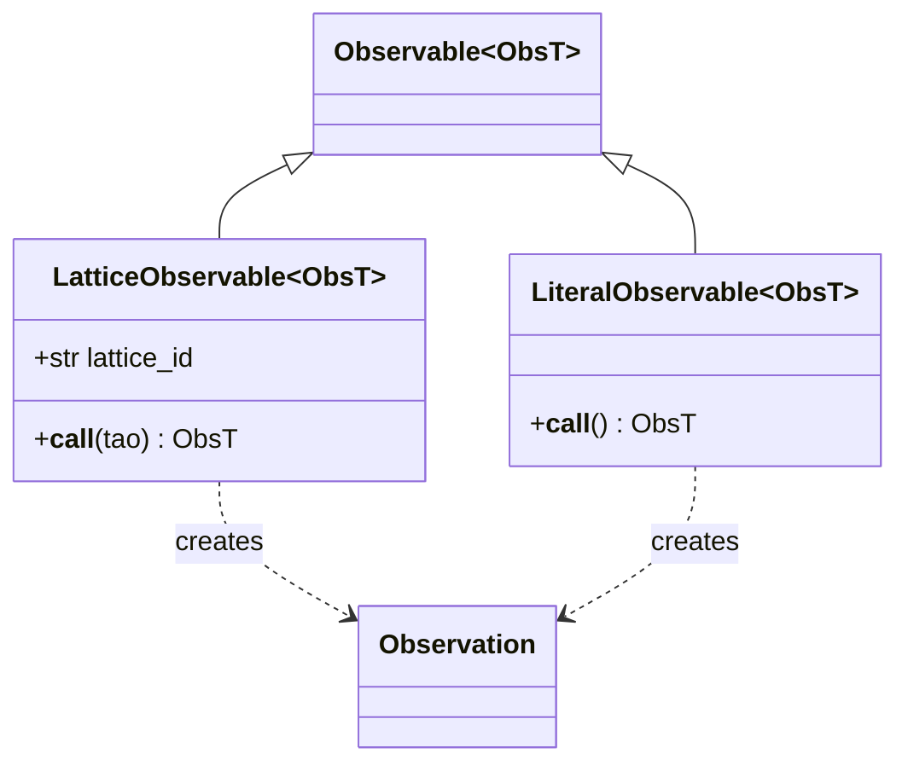
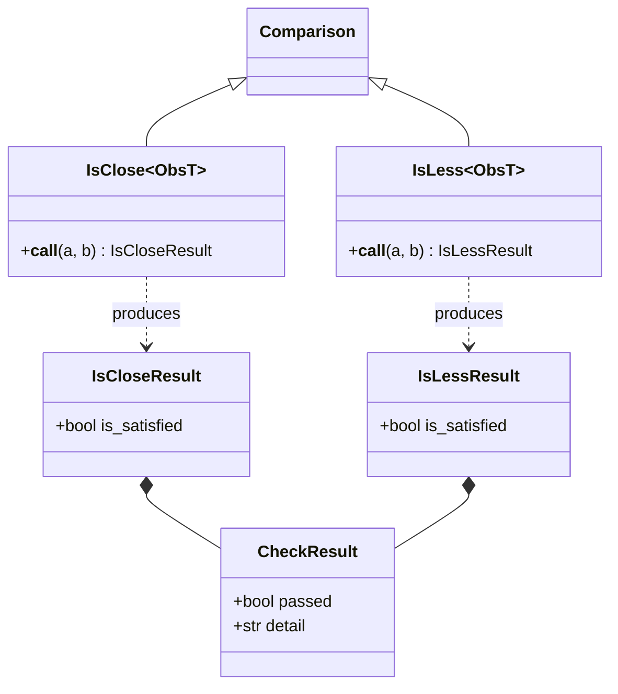
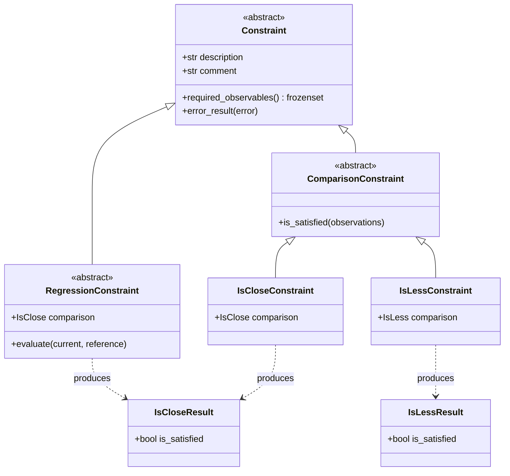

# Constraints API

The structure of the constraints checking tool is laid out in this section of the documentation.
On this page, we give descriptions of and listings for the abstract base classes.
In particular, for the constraints, results, observations, and operators on the observations.
Concrete classes are organized by the type of observation (i.e., `EleObservation` and `DatumObservation`).
These include:

- [Element Observation Constraints](ele.md)
- [Datum Observation Constraints](datum.md)

## Base Classes

### Observations and Observables

The principle object in the constraints tool is an `Observation`.
This abstract class represents the stored information from a measurement (from the lattice or from a literal).
These measurements are defined by `Observables` which have all of the information needed to produce the `Observation` from a loaded Tao lattice (in the case of a `LatticeObservable`) or from scratch (for a `LiteralObservable`).

An `Observable` is a hashable type allowing the map `obs_map: dict[Observable, Observation]` to be the context needed for constraint checking.
This abstracts the checks allowing collection to take place in a consolidated step that avoids loading lattices multiple times.
Constraints are designed to maximally tolerate and report missing data allowing all checks to be run even when some observations and lattices fail.
It also means that the `obs_map` may be saved to disk and loaded later for regression tests.

#### ::: pytao.constraints.observables.LatticeObservable
#### ::: pytao.constraints.observables.LiteralObservable

### Operators and Results

Comparisons are defined between two `Observation` objects of the same type in the form of operators.
Each operator produces a typed result containing per-field `CheckResult` entries.

### Constraint Hierarchy

`Constraint` is the abstract base for all checks.
`ComparisonConstraint` objects compare two live observations against each other.
`RegressionConstraint` objects allow the definition of pure regression tests.
These don't show up in test results unless there is a comparison set of observations saved from a previous run of the tool. 
Note: regression tests are also automatically defined for constraints involving an equality operator.

