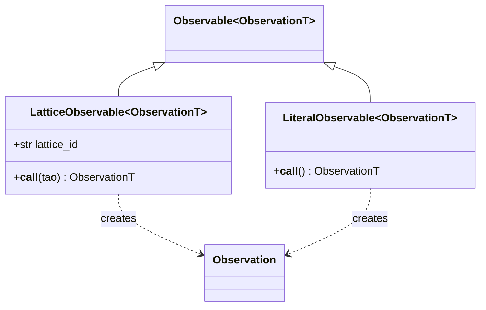
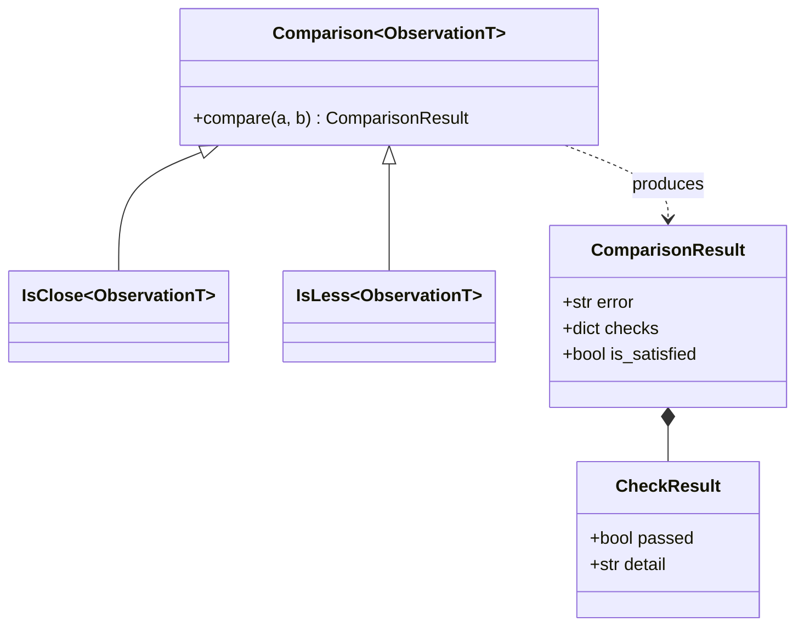
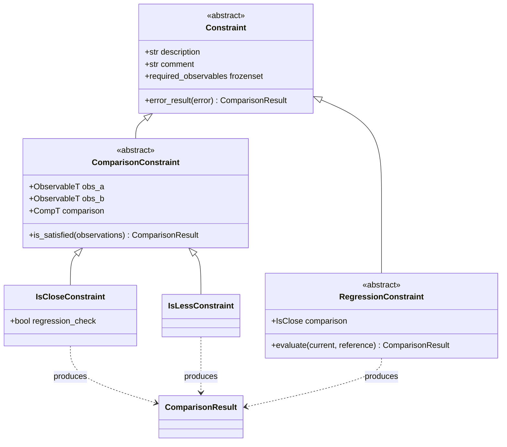

# Constraints API

The structure of the constraints checking tool is laid out in this section of the documentation.
On this page, we give descriptions of and listings for the abstract base classes.
In particular, for the constraints, results, observations, and operators on the observations.
Concrete classes are organized by the type of observation (i.e., `EleObservation` and `DatumObservation`).
These include:

- [Element Observation Constraints](ele.md)
- [Datum Observation Constraints](datum.md)

All concrete classes carry a `type` discriminator field which selects them in the YAML configuration file.
The discriminator is always serialized, even when defaults are otherwise excluded, so that saved observations and results can be loaded back unambiguously.

## Base Classes

### Observations and Observables

The principle object in the constraints tool is an `Observation`.
This abstract class represents the stored information from a measurement (from the lattice or from a literal).
These measurements are defined by `Observables` which have all of the information needed to produce the `Observation` from a loaded Tao lattice (in the case of a `LatticeObservable`) or from scratch (for a `LiteralObservable`).

An `Observable` is a hashable type allowing the map `obs_map: dict[Observable, Observation]` to be the context needed for constraint checking.
This abstracts the checks allowing collection to take place in a consolidated step that avoids loading lattices multiple times.
Constraints are designed to maximally tolerate and report missing data allowing all checks to be run even when some observations and lattices fail.
It also means that the `obs_map` may be saved to disk and loaded later for regression tests.

```mermaid
classDiagram
    class Observation
    class Observable~ObservationT~
    class LatticeObservable~ObservationT~ {
        +str lattice_id
        +__call__(tao) ObservationT
    }
    class LiteralObservable~ObservationT~ {
        +__call__() ObservationT
    }
    Observable <|-- LatticeObservable
    Observable <|-- LiteralObservable

    LatticeObservable ..> Observation : creates
    LiteralObservable ..> Observation : creates
```

#### ::: pytao.constraints.observables.Observation
#### ::: pytao.constraints.observables.Observable
#### ::: pytao.constraints.observables.LatticeObservable
#### ::: pytao.constraints.observables.LiteralObservable

### Operators and Results

Comparisons are defined between two `Observation` objects of the same type in the form of operators.
A `Comparison` is generic over the `Observation` type it acts on.
`IsClose` marks approximate equality operators and `IsLess` marks component-wise less-than operators.
Every operator produces the same `ComparisonResult`, which holds an optional `error` string and a `checks` dictionary of per-field `CheckResult` entries keyed by field name.
The `is_satisfied` property is computed from these: it is `False` when an error is set, and otherwise `True` when every check passed (including when nothing was checked).

```mermaid
classDiagram
    class Comparison~ObservationT~ {
        +compare(a, b) ComparisonResult
    }
    class IsClose~ObservationT~
    class IsLess~ObservationT~
    Comparison <|-- IsClose
    Comparison <|-- IsLess

    class CheckResult {
        +bool passed
        +str detail
    }
    class ComparisonResult {
        +str error
        +dict checks
        +bool is_satisfied
    }

    Comparison ..> ComparisonResult : produces
    ComparisonResult *-- CheckResult
```

#### ::: pytao.constraints.observables.Comparison
#### ::: pytao.constraints.observables.IsClose
#### ::: pytao.constraints.observables.IsLess
#### ::: pytao.constraints.observables.ComparisonResult
#### ::: pytao.constraints.observables.CheckResult

### Constraint Hierarchy

`Constraint` is the abstract base for all checks.
`ComparisonConstraint` objects compare two live observations against each other.
They are generic over the observable type accepted by `obs_a` and `obs_b` and over the comparison operator type, so the concrete element and datum constraints only need to declare their `type` discriminator and defaults.
The `comparison` field may hold either an operator or the name of an entry in the config file's shared `comparisons` section.
`RegressionConstraint` objects allow the definition of pure regression tests.
These don't show up in test results unless there is a comparison set of observations saved from a previous run of the tool. 
Note: regression tests are also automatically defined for constraints involving an equality operator.

```mermaid
classDiagram
    class Constraint {
        <<abstract>>
        +str description
        +str comment
        +required_observables frozenset
        +error_result(error) ComparisonResult
    }
    class ComparisonConstraint {
        <<abstract>>
        +ObservableT obs_a
        +ObservableT obs_b
        +CompT comparison
        +is_satisfied(observations) ComparisonResult
    }
    class IsCloseConstraint {
        +bool regression_check
    }
    class IsLessConstraint
    class RegressionConstraint {
        <<abstract>>
        +IsClose comparison
        +evaluate(current, reference) ComparisonResult
    }
    class ComparisonResult

    Constraint <|-- ComparisonConstraint
    Constraint <|-- RegressionConstraint
    ComparisonConstraint <|-- IsCloseConstraint
    ComparisonConstraint <|-- IsLessConstraint
    IsCloseConstraint ..> ComparisonResult : produces
    IsLessConstraint ..> ComparisonResult : produces
    RegressionConstraint ..> ComparisonResult : produces
```
