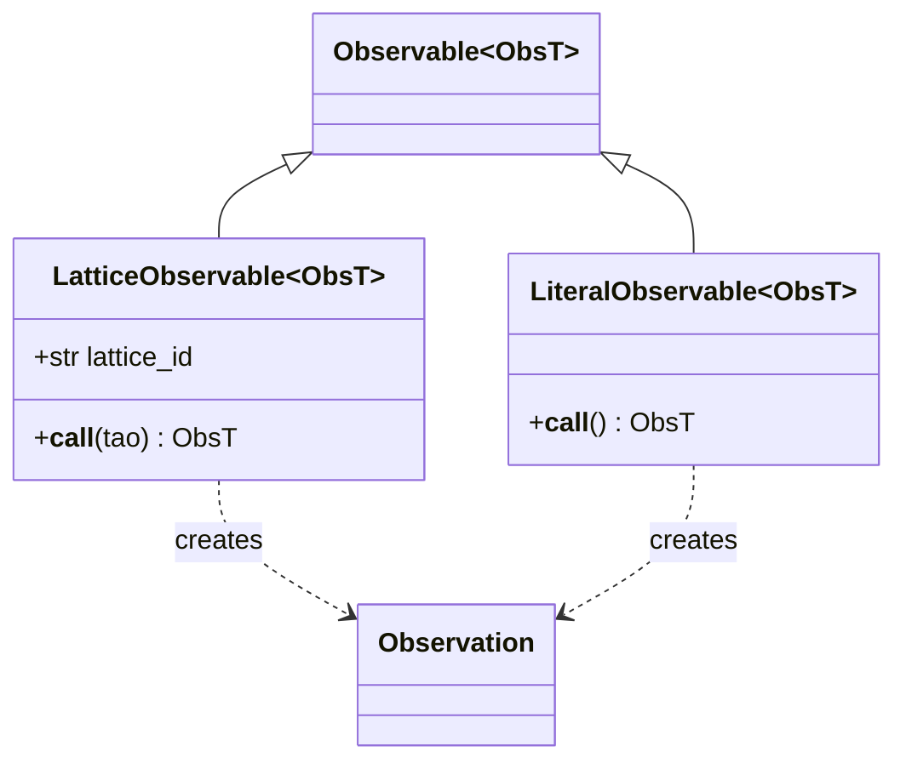
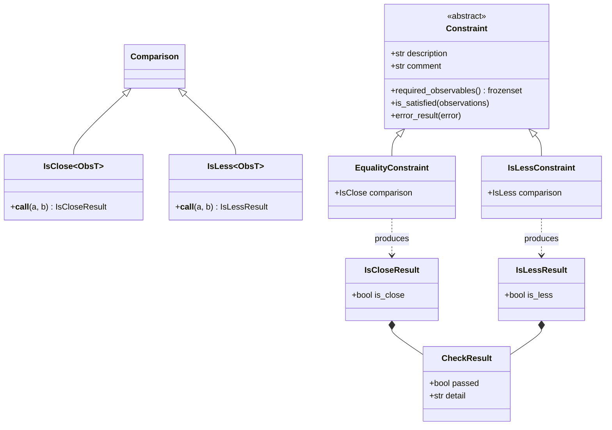
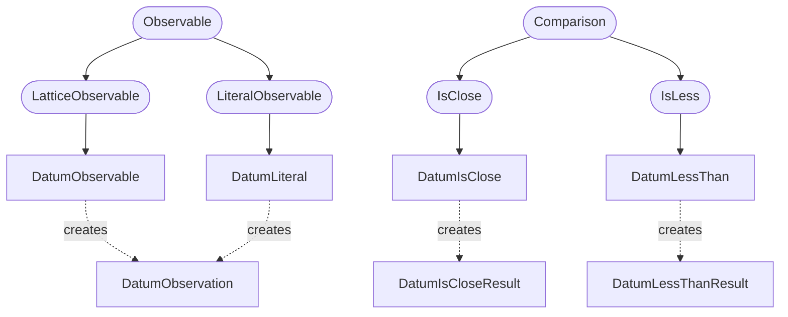
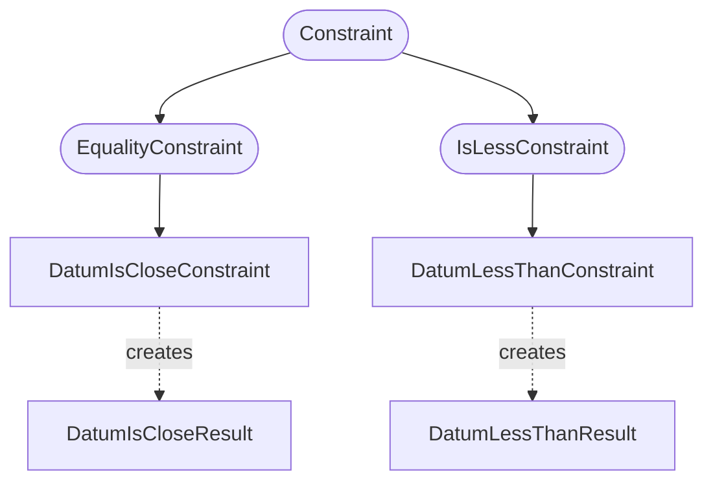
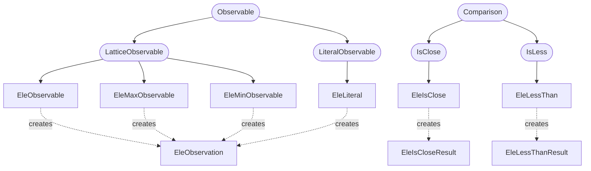
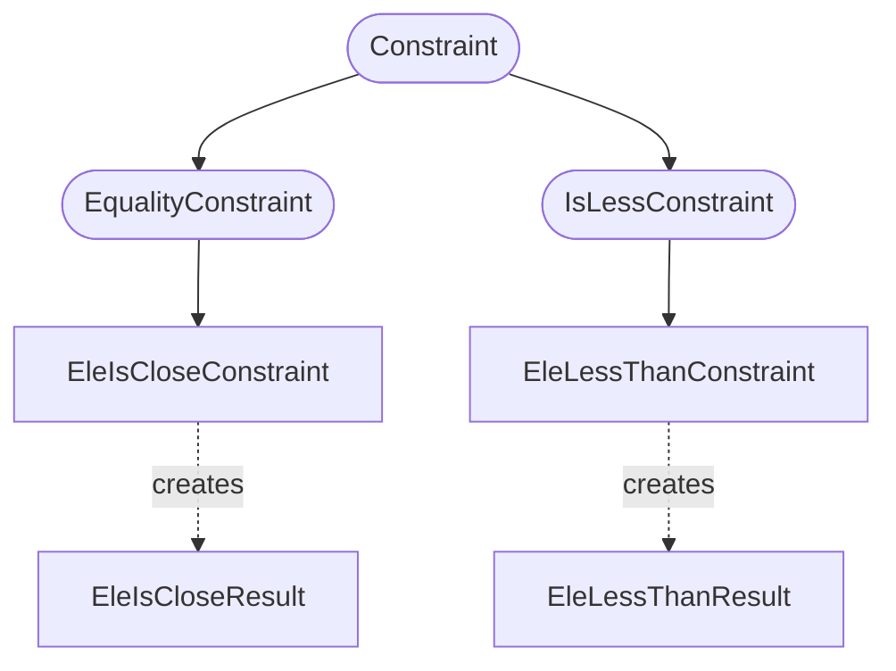

# Bmad Lattice Constraint Checker Tool

Pytao includes a CLI / configuration-file-based tool to define and then check constraints among a set of Bmad lattices.
The values computed from the lattices may be saved and then loaded as a reference for further runs for regression testing.

## Class Structure

The folowing inheritance diagrams are provided to aid developers in understanding the constraints codebase.

### Base Classes

#### Observations and Observables

The principle object in the constraints tool is an `Observation`.
This abstract class represents the stored information from a measurement (from the lattice or from a literal).
These measurements are defined by `Observables` which have all of the information needed to produce the `Observation` from a loaded Tao lattice (in the case of a `LatticeObservable`) or from scratch (for a `LiteralObservable`).

An `Observable` is a hashable type allowing the map `obs_map: dict[Observable, Observation]` to be the context needed for constraint checking.
This abstracts the checks allowing collection to take place in a consolidated step that avoids loading lattices multiple times.
Constraints are designed to maximally tolerate and report missing data allowing all checks to be run even when some observations and lattices fail.
It also means that the `obs_map` may be saved to disk and loaded later for regression tests.

#### Operators, Constraints, and Results

Comparisons are defined between two `Observation` objects of the same type in the form of operators.
These operators may belong to `Constraint` objects which define the checks performed on the lattices.
These checks produce `ConstraintResult` objects which can be printed from the CLI tool and saved as an artifact from the tests run.

### Concrete Classes

The following notes document the concrete classes used in the constraints tool organized by `Observation` type.

#### Datum

A `DatumObservation` stores the output of a tao datum.
These can be defined and evaluated on the fly using a `DatumObservable`.

##### Observations, Observables, and Operators

##### Constraints, and Results

#### Element

An `EleObservation` contains the output of a `tao.ele(...)` call (ie Twiss parameters, reference energy, floor positions, etc.).
The observation may be evaluted from a single element in a lattice with `EleObservable`.
The min and max of the values in the element can be evaluated using `EleMinObservable` and `EleMaxObservable`.

##### Observations, Observables, and Operators

##### Constraints, and Results

