# Bmad Lattice Constraint Checker Tool

Pytao includes a CLI / configuration-file-based tool to define and then check constraints among a set of Bmad lattices.
The values computed from the lattices may be saved and then loaded as a reference for further runs for regression testing.

## Class Structure

### Observables, Observations, and Operators

```mermaid
classDiagram
    namespace Observations {
        class Observation {
            +float elapsed_time
            +datetime created_at
        }
        class DatumObservation {
            +float model_value
            +float design_value
        }
        class EleObservation {
            +Element element
        }
    }
    Observation <|-- DatumObservation
    Observation <|-- EleObservation

    namespace Observables {
        class Observable {
            <<generic ObsT>>
            +label() str
        }
        class LatticeObservable {
            <<generic ObsT>>
            +str lattice_id
            +__call__(tao) ObsT
        }
        class LiteralObservable {
            <<generic ObsT>>
            +__call__() ObsT
        }
        class DatumObservable {
            +str data_type
            +str ele_name
            +str data_source
        }
        class EleObservable {
            +str ele_id
        }
        class EleMaxObservable
        class EleMinObservable
        class DatumLiteral {
            +float model_value
            +float design_value
        }
        class EleLiteral {
            +float beta_a
            +float alpha_a
            +...
        }
    }
    Observable <|-- LatticeObservable
    Observable <|-- LiteralObservable
    LatticeObservable <|-- DatumObservable
    LatticeObservable <|-- EleObservable
    LatticeObservable <|-- EleMaxObservable
    LatticeObservable <|-- EleMinObservable
    LiteralObservable <|-- DatumLiteral
    LiteralObservable <|-- EleLiteral

    DatumObservable ..> DatumObservation : creates
    DatumLiteral ..> DatumObservation : creates
    EleObservable ..> EleObservation : creates
    EleMaxObservable ..> EleObservation : creates
    EleMinObservable ..> EleObservation : creates
    EleLiteral ..> EleObservation : creates

    namespace Operators {
        class Comparison {
            <<abstract>>
        }
        class IsClose {
            <<generic ObsT>>
            +__call__(a, b) IsCloseResult
        }
        class IsLess {
            <<generic ObsT>>
            +__call__(a, b) IsLessResult
        }
        class TolComparison {
            +float atol
            +float rtol
            +__call__(x0, x1) CheckResult
        }
        class TwissComparisonMethod {
            <<abstract>>
            +__call__(beta0, alpha0, beta1, alpha1) CheckResult
        }
        class BmagTwissComparison {
            +float max_bmag
            +float min_bmag
        }
        class DummyTwissComparison
        class DatumIsClose {
            +TolComparison model_value_test
            +TolComparison design_value_test
        }
        class EleIsClose {
            +TwissComparisonMethod twiss_a_test
            +TwissComparisonMethod twiss_b_test
            +TolComparison eta_x_test
            +...
        }
        class DatumLessThan {
            +bool model_value
            +bool design_value
        }
        class EleLessThan {
            +bool beta_a
            +bool alpha_a
            +...
        }
    }
    Comparison <|-- IsClose
    Comparison <|-- IsLess
    IsClose <|-- DatumIsClose
    IsClose <|-- EleIsClose
    IsLess <|-- DatumLessThan
    IsLess <|-- EleLessThan
    TwissComparisonMethod <|-- BmagTwissComparison
    TwissComparisonMethod <|-- DummyTwissComparison

    EleIsClose *-- TolComparison
    EleIsClose *-- TwissComparisonMethod
    DatumIsClose *-- TolComparison

    DatumIsClose ..> DatumObservation : operates on
    EleIsClose ..> EleObservation : operates on
    DatumLessThan ..> DatumObservation : operates on
    EleLessThan ..> EleObservation : operates on
```

### Constraints and Results

```mermaid
classDiagram
    namespace Constraints {
        class Constraint {
            <<abstract>>
            +str description
            +str comment
            +required_observables() frozenset
            +is_satisfied(observations) ComparisonResult
            +error_result(error) ComparisonResult
        }
        class EqualityConstraint {
            +IsClose comparison
        }
        class EleIsCloseConstraint {
            +EleObservable obs_a
            +EleObservable obs_b
            +EleIsClose comparison
        }
        class EleLessThanConstraint {
            +EleObservable obs_a
            +EleObservable obs_b
            +EleLessThan comparison
        }
        class DatumIsCloseConstraint {
            +DatumObservable obs_a
            +DatumObservable obs_b
            +DatumIsClose comparison
        }
        class DatumLessThanConstraint {
            +DatumObservable obs_a
            +DatumObservable obs_b
            +DatumLessThan comparison
        }
        class ConstraintsConfig {
            +dict lattices
            +list constraints
        }
    }
    Constraint <|-- EqualityConstraint
    Constraint <|-- EleLessThanConstraint
    Constraint <|-- DatumLessThanConstraint
    EqualityConstraint <|-- EleIsCloseConstraint
    EqualityConstraint <|-- DatumIsCloseConstraint
    ConstraintsConfig *-- Constraint

    namespace Results {
        class CheckResult {
            +bool passed
            +str detail
        }
        class ComparisonResult {
            <<abstract>>
            +str error
        }
        class IsCloseResult {
            +bool is_close
        }
        class IsLessResult {
            +bool is_less
        }
        class DatumIsCloseResult {
            +CheckResult model_value
            +CheckResult design_value
        }
        class EleIsCloseResult {
            +CheckResult twiss_a
            +CheckResult twiss_b
            +CheckResult eta_x
            +...
        }
        class DatumLessThanResult {
            +CheckResult model_value
            +CheckResult design_value
        }
        class EleLessThanResult {
            +CheckResult beta_a
            +CheckResult alpha_a
            +...
        }
        class ConstraintResults {
            +datetime started_at
            +datetime finished_at
            +dict lattices
            +list constraints
            +list regression
        }
        class LatticeResult {
            +str lattice_file
            +bool loaded
            +float load_time
            +float obs_time
            +str error
        }
        class ConstraintResult {
            +list observables
            +str description
            +ComparisonResult result
        }
        class RegressionResult {
            +Observable observable
            +ComparisonResult result
        }
        class SavedObservations {
            +list entries
        }
    }
    ComparisonResult <|-- IsCloseResult
    ComparisonResult <|-- IsLessResult
    IsCloseResult <|-- DatumIsCloseResult
    IsCloseResult <|-- EleIsCloseResult
    IsLessResult <|-- DatumLessThanResult
    IsLessResult <|-- EleLessThanResult

    DatumIsCloseResult *-- CheckResult
    EleIsCloseResult *-- CheckResult
    DatumLessThanResult *-- CheckResult
    EleLessThanResult *-- CheckResult

    ConstraintResults *-- LatticeResult
    ConstraintResults *-- ConstraintResult
    ConstraintResults *-- RegressionResult
    ConstraintResult *-- ComparisonResult
    RegressionResult *-- ComparisonResult
```

